### Video Submission Link: https://drive.google.com/drive/folders/19H8RAABVZ1dCw0p4YTw2ry5hKUAxjPj8?usp=sharing


## Executive Summary
PatientInsight is deployed as a cloud-native solution leveraging Amazon Web Services (AWS) as the primary cloud provider. This deployment strategy enables scalable, reliable, and secure delivery of our medical symptom analysis pipeline.

## Cloud Infrastructure Overview

### Deployment Environment: Cloud-Based Solution
PatientInsight is implemented as a cloud deployment, utilizing AWS's comprehensive suite of services to create a robust and scalable architecture.

### Cloud Provider: Amazon Web Services (AWS)

#### Core Services Utilized
1. **Storage and Data Management**
   - Amazon S3
     * Primary storage for datasets
     * DVC data repository
     * Artifact storage
   - Amazon RDS
     * Relational database management
     * Persistent data storage

2. **Machine Learning Infrastructure**
   - Amazon SageMaker
     * MLflow experiment tracking and model registry
     * Pre-trained LLM deployment
     * Inference endpoint management

3. **Containerization and Orchestration**
   - Amazon Elastic Container Registry (ECR)
     * Docker image repository
     * Container versioning
   - Amazon Elastic Kubernetes Service (EKS)
     * Kubernetes cluster management
     * Pod orchestration
     * Node scaling
     * Deployment management

4. **Serverless Computing**
   - AWS Lambda
     * Automated DAG triggers
     * Event-driven pipeline execution

5. **Compute Resources**
   - Amazon EC2
     * Compute instances
     * Application hosting

6. **Monitoring and Logging**
   - Amazon Managed Service for Prometheus
     * Deployment monitoring
     * Performance metrics
   - Amazon CloudWatch
     * Centralized logging
     * System monitoring

This cloud-based architecture provides the foundation for our healthcare analytics system, ensuring high availability, scalability, and robust security measures while maintaining operational efficiency.

## Deployment Replication Guide

### Prerequisites Setup

This are all the prerequisites that you need to setup before deploying the cloning this repository and running the deployment script which does not require any manual intervention.

#### 1. AWS Account and CLI Configuration
```bash
# Install AWS CLI
curl "https://awscli.amazonaws.com/awscli-exe-linux-x86_64.zip" -o "awscliv2.zip"
unzip awscliv2.zip
sudo ./aws/install

# Configure AWS CLI
aws configure
# Enter your AWS Access Key ID
# Enter your AWS Secret Access Key
# Region: us-east-2
# Output format: json
```

#### 2. Required Tools Installation
```bash
# Install Docker
sudo apt-get update
sudo apt-get install docker.io
sudo usermod -aG docker $USER

# Install kubectl
curl -LO "https://dl.k8s.io/release/$(curl -L -s https://dl.k8s.io/release/stable.txt)/bin/linux/amd64/kubectl"
sudo install -o root -g root -m 0755 kubectl /usr/local/bin/kubectl

# Install eksctl
curl --silent --location "https://github.com/weaveworks/eksctl/releases/latest/download/eksctl_$(uname -s)_amd64.tar.gz" | tar xz -C /tmp
sudo mv /tmp/eksctl /usr/local/bin
```

### Infrastructure Setup

#### 1. Create EKS Cluster
```bash
eksctl create cluster \
    --name patient-insight-eks-cluster \
    --region us-east-2 \
    --node-type c4.xlarge \
    --nodes-min 2 \
    --nodes-max 4 \
    --with-oidc \
    --ssh-access \
    --ssh-public-key your-key-name \
    --managed
```

#### 2. Create ECR Repositories
```bash
# Create repositories for frontend and backend
aws ecr create-repository --repository-name frontend
aws ecr create-repository --repository-name backend
```

### Application Deployment

Here you clone the repository and configure the environment variable, and then run the deployment script **deploy.sh** which does not require any manual intervention.

#### 1. Clone Repository
```bash
git clone https://github.com/your-repo/PatientInsight.git
cd PatientInsight
```

#### 2. Environment Configuration
Create a `.env` file in the root directory:
```env
AWS_REGION=us-east-2
OPENAI_API_KEY=your_openai_key
PINECONE_API_KEY=your_pinecone_key
PINECONE_ENVIRONMENT=your_environment
PINECONE_INDEX_NAME=your_index
AWS_ACCESS_KEY_ID=your_aws_key
AWS_SECRET_ACCESS_KEY=your_aws_secret
```

#### 3. Automated Deployment
```bash
# Make the deployment script executable
chmod +x deploy.sh

# Run the deployment script
./deploy.sh
```

### Validation Steps

The deployment script will output the pods, nodes status(check if that is running fine), along with that it also outputs the frontend and backend URLs which you can use to access the application. 

You can copy the frontend External IP and paste it in the browser to access the application.

### Troubleshooting Guide If you face any issues:

#### Common Issues and Solutions

1. **Pod Startup Issues**
```bash
# Check pod details
kubectl describe pod <pod-name>

# Check pod logs
kubectl logs <pod-name>
```

2. **Service Connection Issues**
```bash
# Verify service endpoints
kubectl get endpoints

# Check service details
kubectl describe service <service-name>
```

3. **Image Pull Errors**
```bash
# Verify ECR authentication
aws ecr get-login-password --region us-east-2 | docker login --username AWS --password-stdin $ECR_REGISTRY

# Check pod events
kubectl get events --sort-by='.lastTimestamp'
```

### Cleanup Instructions
```bash
# Delete services
kubectl delete service frontend-service backend-service

# Delete deployments
kubectl delete deployment frontend backend

# Delete cluster
eksctl delete cluster --name patient-insight-eks-cluster --region us-east-2
```

### Security Considerations
- Regularly rotate AWS access keys
- Use AWS Secrets Manager for sensitive information
- Implement network policies in EKS
- Monitor CloudWatch logs for security events
- Keep all tools and dependencies updated

For additional support or troubleshooting, please refer to our project documentation or create an issue in the GitHub repository.


## Kubernetes Infrastructure and Deployment Architecture

### Overview
The PatientInsight application is deployed on Amazon Elastic Kubernetes Service (EKS), implementing a robust and scalable microservices architecture. This section details our Kubernetes infrastructure configuration, highlighting the deployment strategy and architectural decisions that ensure high availability, scalability, and maintainable operations.

### Container Registry and Image Management

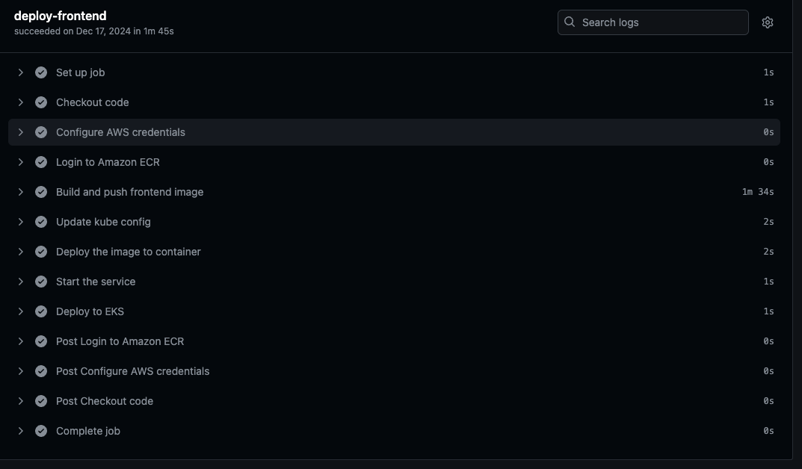

Our containerization strategy leverages Amazon Elastic Container Registry (ECR) for secure and efficient image management. The application architecture is divided into two primary components, each maintained in dedicated repositories:
- A frontend repository housing the user interface components
- A backend repository containing the core application logic and API services

Both repositories are configured with AES-256 encryption, ensuring the security of our container images. The repositories support mutable tags, facilitating our continuous deployment pipeline and enabling rapid iterations of our application components.

### Kubernetes Cluster Architecture

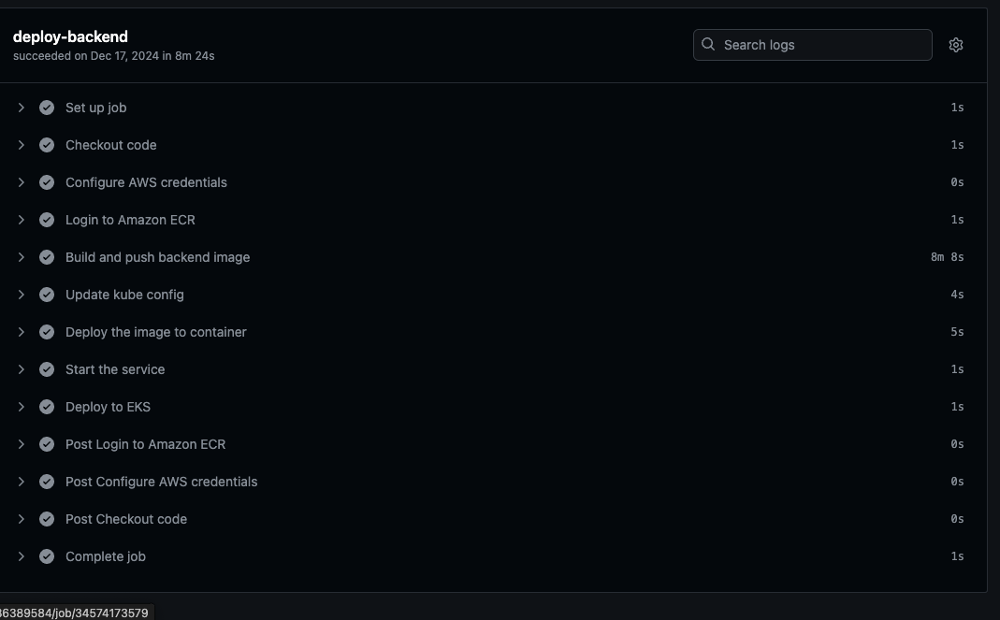
The production environment operates on a dedicated EKS cluster named `patient-insight-eks-cluster`. This cluster represents our commitment to container orchestration excellence, running on Kubernetes version 1.31. The cluster architecture is designed with both performance and cost-efficiency in mind, implementing a sophisticated node group configuration that balances resource availability with operational costs.

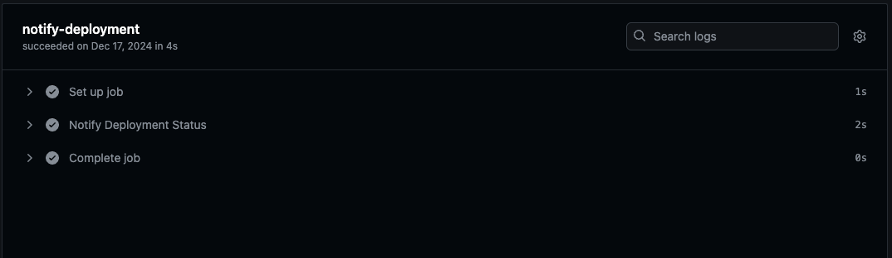

Our node group configuration exemplifies this balance:
- We utilize c4.xlarge instances, providing robust computational resources for our containerized workloads
- The cluster maintains a baseline of two nodes while allowing elastic scaling up to four nodes based on demand
- Each node is provisioned with 50 GiB of storage, ensuring ample space for container images and ephemeral storage
- The AMI type (AL2_x86_64) was selected for its stability and comprehensive AWS integration capabilities

### Pod Distribution and Service Architecture

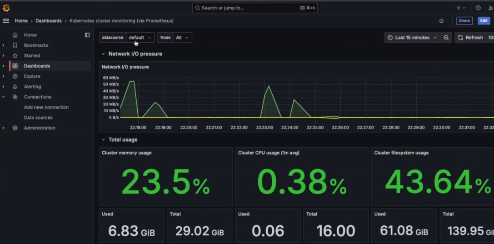

The cluster currently orchestrates 14 pods, distributed strategically across two nodes. This distribution reflects our microservices architecture and includes several key components:

The pod architecture can be categorized into three main groups:

1. **Core Application Services**
   Our application pods are deployed with redundancy in mind, running multiple replicas of both frontend and backend services. This configuration ensures high availability and enables zero-downtime deployments.

2. **System and Infrastructure Services**
   The cluster maintains essential AWS integration services, including load balancer controllers and EBS CSI drivers, facilitating seamless integration with AWS infrastructure services.

3. **Monitoring and Observability Stack**
   We implement a comprehensive monitoring solution through CloudWatch agents, Fluent Bit for logging, and Grafana for metrics visualization, ensuring complete observability of our application stack.


### Service Architecture and Network Communication

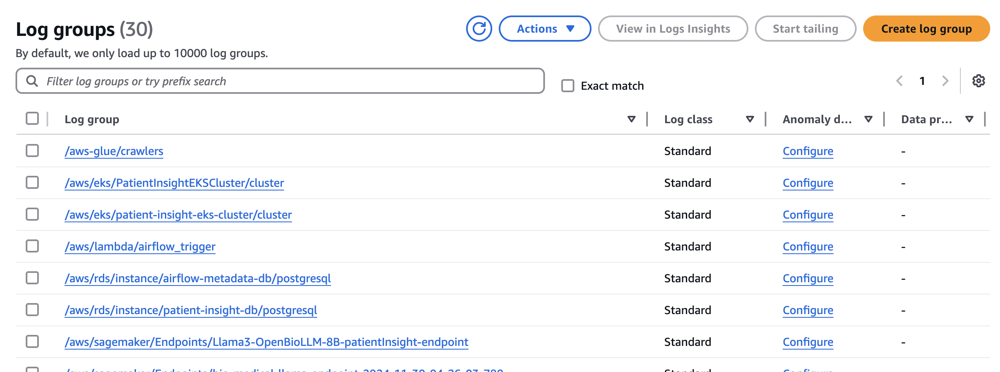

The application's networking layer is orchestrated through Kubernetes Services, providing stable networking interfaces for our components:

#### Service Configuration
Our Kubernetes deployment includes three essential services:
- `frontend-service`: A LoadBalancer service exposing the frontend to external traffic
  * External IP: k8s-default-frontend-83b9bf328b-4645da8feaa0ec6e.elb.us-east-2.amazonaws.com
  * Port: 80:30619/TCP
  * Type: LoadBalancer

- `backend-service`: A LoadBalancer service for backend API access
  * External IP: k8s-default-backends-848a823787-ea2281742964f835.elb.us-east-2.amazonaws.com
  * Port: 80:30587/TCP
  * Type: LoadBalancer

- `kubernetes`: The default ClusterIP service
  * Internal IP: 10.100.0.1
  * Port: 443/TCP
  * Type: ClusterIP

#### Inter-Service Communication
The frontend and backend services are configured to enable seamless communication within the cluster. The frontend service communicates with the backend through its internal cluster IP (10.100.246.222), while being accessible to external users through its load balancer endpoint. This architecture ensures:
- Secure internal communication between components
- External accessibility through managed load balancers
- Network isolation where appropriate
- High availability through AWS's elastic load balancing

This service configuration creates a robust networking layer that supports both internal application communication and external user access, while maintaining security and scalability of the overall system.

### Load Balancing Strategy

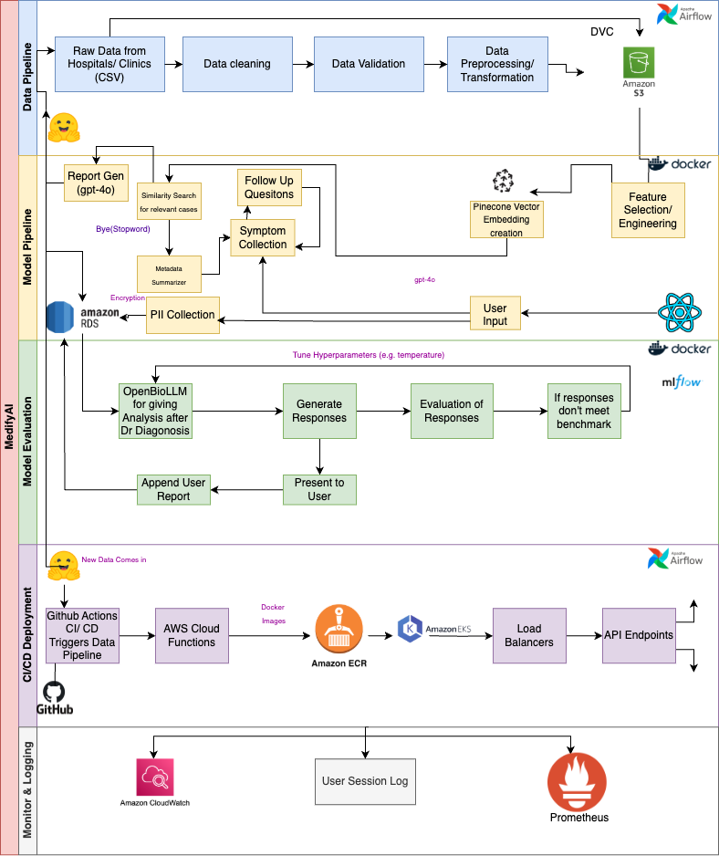

Our load balancing architecture implements a dual-layer approach using AWS Network Load Balancers:

The frontend load balancer (`k8s-default-frontend`) serves as the primary entry point for user traffic, configured as an internet-facing load balancer spanning three availability zones. This configuration ensures optimal distribution of incoming traffic and maintains high availability through zone redundancy.

The backend load balancer (`k8s-default-backends`) manages internal service communication, implementing sophisticated health checking mechanisms and cross-zone load balancing to maintain service reliability.

### Network Architecture and Security
The network architecture is built on AWS VPC infrastructure, implementing a multi-availability zone deployment strategy. This design ensures resilience against zone failures and optimal latency for end-users. The network configuration spans three availability zones, with dedicated subnets for different aspects of our application infrastructure.

### Scalability and Resource Management
Our infrastructure implements horizontal pod autoscaling and cluster autoscaling capabilities. The node group configuration allows for dynamic scaling between 2 and 4 nodes, with the following characteristics:
- Minimum node count: 2 (ensuring high availability)
- Maximum node count: 4 (allowing for traffic spikes)
- Desired capacity: 2 (optimizing for standard operation)

This configuration enables the cluster to automatically scale based on demand while maintaining cost efficiency during periods of lower utilization.

### Monitoring and Observability
The deployment includes a comprehensive monitoring stack:
- CloudWatch integration for metric collection and log aggregation
- Fluent Bit for efficient log forwarding
- Grafana dashboards for metric visualization
- Custom health checks and readiness probes for service monitoring

This robust monitoring setup ensures operational visibility and enables proactive issue resolution.

### Prometheus Implementation


We utilize Amazon Managed Service for Prometheus for metrics collection and storage, configured through a dedicated workspace (ws-16414bce-3756-40fc-8f4f-218915a2a049). The service automatically scrapes metrics from our EKS cluster, including:
- Pod performance metrics
- Node resource utilization
- API endpoint response times
- Custom application metrics
- Model inference latencies

### Grafana Dashboards

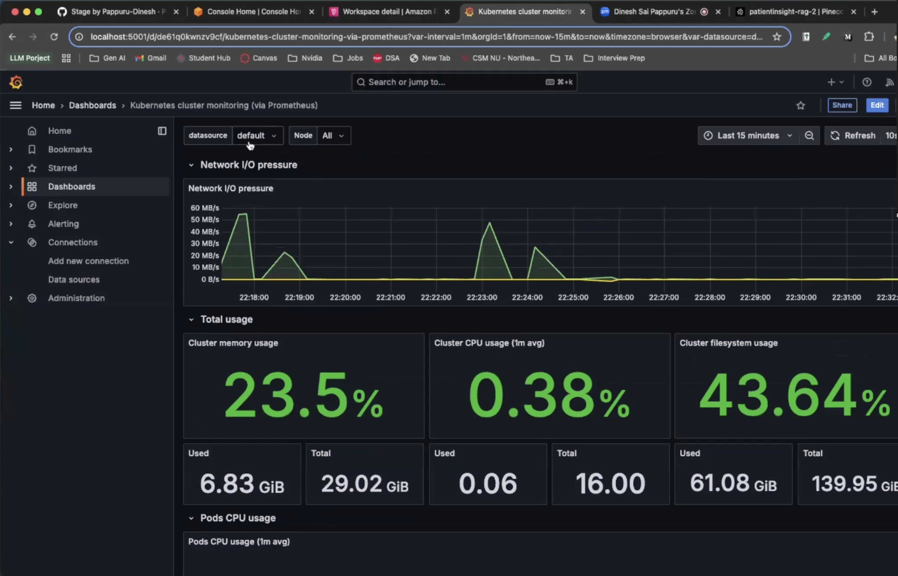

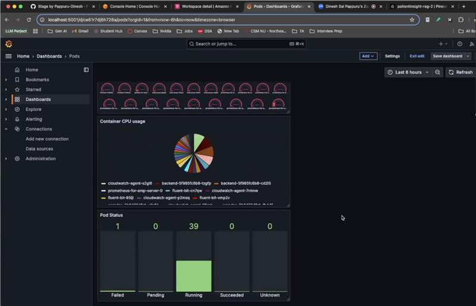

Our Grafana implementation provides intuitive visualization of system metrics through custom dashboards:

1. **Kubernetes Cluster Overview**
   - Node resource utilization
   - Pod health status
   - Container metrics
   - Network performance

2. **Application Performance**
   - API response times
   - Request rates
   - Error rates
   - Service latencies

3. **Model Performance**
   - Inference times
   - Model throughput
   - Memory usage
   - GPU utilization

### Integration Points
The monitoring stack is fully integrated with our infrastructure:
- Direct metric collection from EKS cluster
- Custom metric endpoints for application monitoring
- Automated alerting based on defined thresholds
- Real-time visualization of system health

This comprehensive monitoring solution ensures complete visibility into our system's operational status while enabling quick identification and resolution of potential issues.

### Conclusion
Our Kubernetes infrastructure represents a well-architected solution that balances scalability, reliability, and operational efficiency. The combination of strategic pod distribution, sophisticated load balancing, and comprehensive monitoring creates a resilient platform capable of supporting our healthcare application's demanding requirements while maintaining security and performance standards.


## Automated Data Processing with AWS Lambda

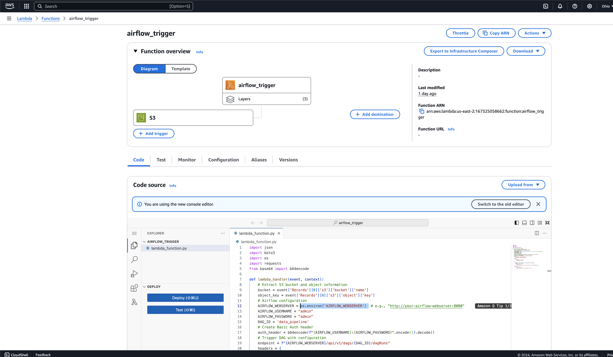

### Overview
Our project implements an automated data processing pipeline using AWS Lambda, designed to streamline the handling of new medical datasets. This serverless solution automatically triggers our data processing workflows whenever new data is uploaded to our S3 storage bucket, ensuring continuous updates to our medical analysis system.

### Lambda Function Implementation
The core of our automation is a Lambda function that monitors our S3 bucket for new dataset uploads. When new medical data arrives, the function automatically initiates our Airflow DAG (Directed Acyclic Graph), which orchestrates the entire data processing pipeline. This event-driven approach eliminates the need for manual intervention in our data processing workflow, ensuring immediate handling of new information.

### Data Processing Workflow


Upon triggering, the Lambda function initiates a series of data processing steps through our Airflow pipeline. The workflow begins with comprehensive data preprocessing, where the raw medical data is cleaned, standardized, and validated. Following this, the pipeline generates statistical analyses and reports, providing insights into the new dataset's characteristics and quality metrics.

### Vector Database Integration

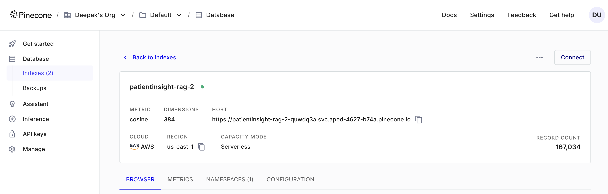
The final stage of our automated pipeline involves generating embeddings for the processed medical data. These embeddings are crucial for our medical analysis system, as they enable efficient similarity searches and case comparisons. The Lambda function ensures that all new data is properly vectorized and stored in our Pinecone vector database, maintaining the system's ability to provide accurate medical insights.

### Security and Monitoring
Our Lambda implementation adheres to AWS security best practices, operating with minimal required permissions through a carefully configured IAM role. The function's activities are monitored through CloudWatch, providing detailed logs and metrics that help maintain system reliability. This monitoring ensures that any processing issues are quickly identified and addressed, maintaining the integrity of our medical data processing pipeline.

### Conclusion
The integration of AWS Lambda in our data processing pipeline represents an efficient, automated approach to handling medical data updates. This serverless architecture ensures that our medical analysis system remains current with minimal operational overhead, while maintaining high standards of data processing and security.

## Amazon SageMaker

### Overview
Our project leverages Amazon SageMaker for model serving(Pretrained model which does not require finetuning or retraining) and experiment tracking, focusing on the deployment of our specialized medical interaction model (OpenBioLLM) and comprehensive MLflow integration. This infrastructure supports our medical analysis pipeline, where users can interact with generated doctor reports through a sophisticated question-answering system.

### Model Deployment Strategy
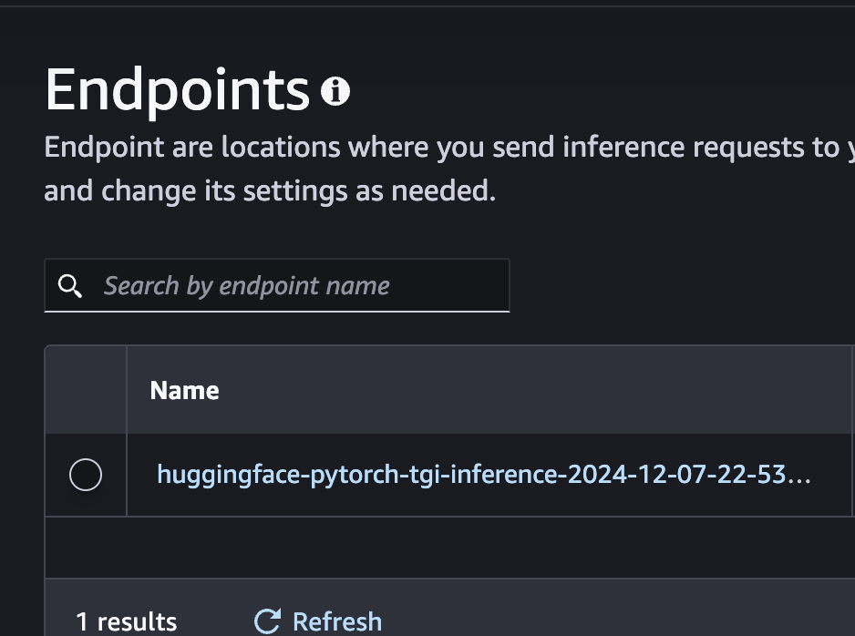

We deploy OpenBioLLM, a Llama-based model fine-tuned on biomedical data(This is a pretrained model from hugging face and we are not finetuning it), through SageMaker's managed endpoints. The deployment process involves packaging the pre-trained model, configuring the endpoint for optimal performance, and establishing auto-scaling policies to handle varying loads. Our endpoint configuration utilizes ml.g4dn.xlarge instances with auto-scaling capabilities, ensuring cost-effective yet responsive model serving.

### Model Versioning and Tracking


The system integrates with SageMaker's managed MLflow service for comprehensive experiment tracking and model versioning. Each model configuration and deployment is tracked through MLflow, with artifacts stored in S3 buckets. This integration enables version control of model configurations, monitoring of deployment performance, and systematic tracking of model interactions. The MLflow dashboard provides insights into model performance metrics, making it easier to maintain and optimize our deployment over time.

### Integration Architecture
The deployment integrates seamlessly with our larger pipeline, where doctor reports generated from our RAG system are stored and versioned in MLflow. Users can query these reports through the deployed OpenBioLLM endpoint, receiving medically-contextualized responses. This architecture ensures reliable model serving while maintaining comprehensive tracking of all model interactions and configurations.