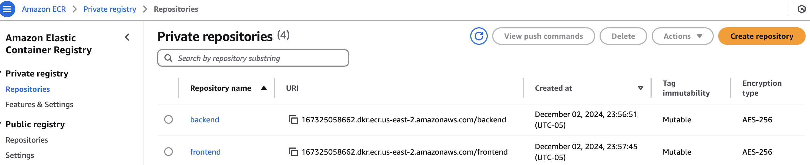
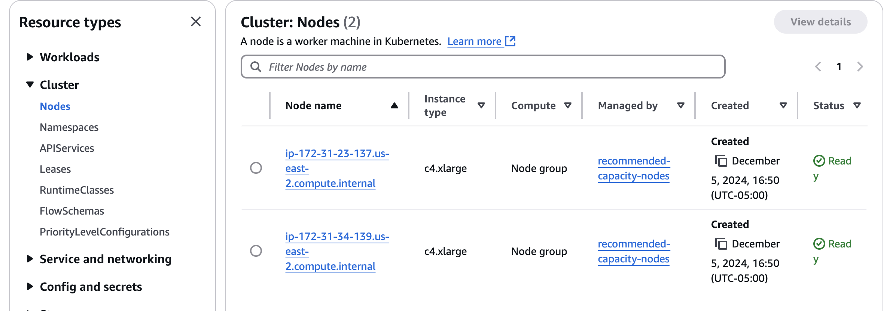

# Deployment

## Outline:

- [Introduction](introduction.md)
- [Scoping](scoping.md)
- [Data Pipeline](data.md)
- [Modeling](modelling.md)
- [Deployment](deployment.md)
- [AWS Deployment Setup](aws_deployment_setup.md)
- [CI/CD](cicd.md)
- [Monitoring](monitoring.md)

## 1. Introduction
MedifyAI is a cloud-native solution designed for scalable, reliable, and secure medical symptom analysis. This document outlines the deployment strategy, highlighting the use of AWS services and the architectural decisions that ensure high availability and scalability.

Here is the video for the deployemnt and the demo: [Video](https://youtu.be/6j9V9x5tGJM)

## 2. Cloud Infrastructure Overview

### 2.1 Deployment Environment: Cloud-Based Solution
PatientInsight leverages AWS's suite of services to create a robust architecture. The core services include:

- **Amazon S3** for storing datasets and artifacts, ensuring scalable and secure data management.
- **Amazon SageMaker** for managing MLflow experiment tracking and model registry, simplifying the deployment and management of machine learning models.
- **Amazon EKS** for Kubernetes cluster management, enabling efficient orchestration and scaling of application components.
- **AWS Lambda** for automating data processing workflows, providing event-driven execution without manual intervention.
- **Amazon EC2** for compute instances, supporting application hosting with flexible resource allocation.
- **Amazon CloudWatch** for centralized logging and system monitoring, offering insights into system health and performance metrics.

This architecture ensures high availability, scalability, and security, forming the foundation of our healthcare analytics system.

## 3. Kubernetes Infrastructure and Deployment Architecture

### 3.1 Overview
The PatientInsight application is deployed on Amazon EKS, implementing a scalable microservices architecture. This setup ensures high availability and zero-downtime deployments.

### 3.2 Container Registry and Image Management

Amazon ECR is used for secure image management, supporting our continuous deployment pipeline.

### 3.3 Kubernetes Cluster Architecture

The EKS cluster is designed for performance and cost-efficiency, using c4.xlarge instances with elastic scaling.

### 3.4 Pod Distribution and Service Architecture

The cluster orchestrates 14 pods, ensuring high availability and zero-downtime deployments.

### 3.5 Service Architecture and Network Communication

Kubernetes Services provide stable networking interfaces, ensuring secure internal communication and external accessibility.

### 3.6 Load Balancing Strategy

AWS Network Load Balancers ensure optimal traffic distribution and high availability.

### 3.7 Monitoring and Observability
The deployment includes CloudWatch, Fluent Bit, and Grafana for comprehensive monitoring and observability.

### 3.8 Conclusion
Our Kubernetes infrastructure balances scalability, reliability, and operational efficiency, supporting our healthcare application's demanding requirements.

## 4. Automated Data Processing with AWS Lambda

### 4.1 Overview
AWS Lambda automates data processing workflows, ensuring continuous updates to our medical analysis system.

### 4.2 Lambda Function Implementation
The Lambda function monitors S3 for new data, triggering our Airflow DAG for data processing.

### 4.3 Data Processing Workflow

The workflow includes data preprocessing, statistical analysis, and vector database integration.

### 4.4 Security and Monitoring
Lambda adheres to AWS security best practices, with activities monitored through CloudWatch.

### 4.5 Conclusion
AWS Lambda provides an efficient, automated approach to handling medical data updates, maintaining high standards of data processing and security.

## 5. Amazon SageMaker

### 5.1 Overview
Amazon SageMaker is used for model serving and experiment tracking, supporting our medical analysis pipeline.

### 5.2 Model Deployment Strategy

OpenBioLLM is deployed through SageMaker's managed endpoints, ensuring responsive model serving.

### 5.3 Model Versioning and Tracking

MLflow integration enables comprehensive experiment tracking and model versioning.

More details on to the deployment can be found [here](https://github.com/deepaku23/MedifyAI/blob/main/docs/README.md)