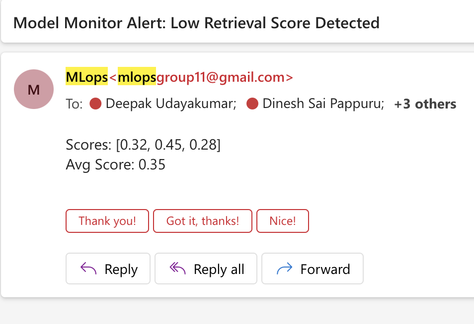
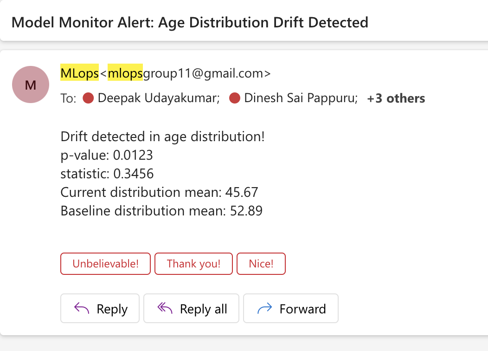
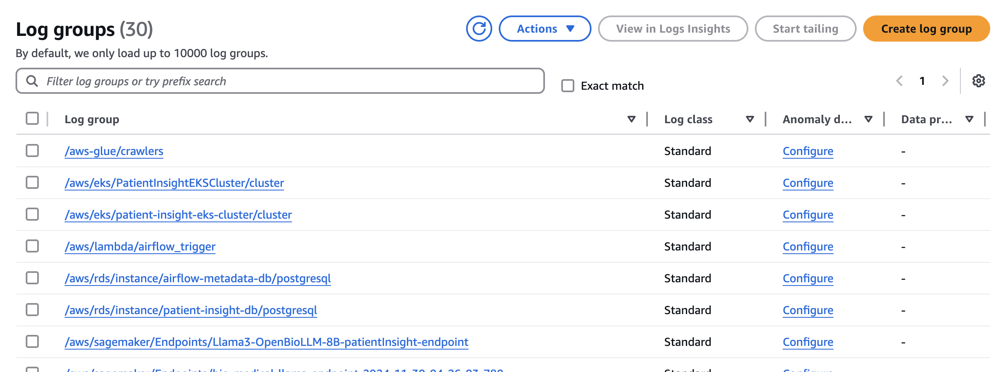

## Model and Data Drift Monitoring

**Since we will be using a pretrained model, we will not be able to retrain the model if there is a model decay. We will be using the pretrained model to generate doctor reports and we will be monitoring the data drift and retrieval performance.**

So by retrival performance, we mean the performance of the RAG system. We set a threshold of 0.5 for the retrieval score. If the retrieval score is below 0.5, we will be sending an alert to the team. We also have a lambda fucntion that generates the embeddings and stores it in the vector database whenever the new data is uploaded to the S3 bucket.

More details about the monitoring system can be found below: 

### Overview
Our healthcare chatbot system implements robust monitoring strategies to ensure reliable performance and early detection of potential issues in the production environment. The monitoring system focuses on two critical aspects: data drift detection and retrieval performance monitoring, complemented by an automated data pipeline for continuous improvement.

### Data Drift Detection Strategy

### Age Distribution Monitoring
Our primary data drift detection mechanism focuses on monitoring the age distribution of incoming patients. The system maintains a baseline distribution derived from our training dataset (PMC-Patients dataset) and continuously compares it with the current patient population using the Kolmogorov-Smirnov test. This statistical approach helps identify significant shifts in patient demographics that could impact model performance.

When the KS test returns a p-value below 0.05, indicating a significant deviation from the baseline distribution, the system automatically triggers an alert. This early warning system enables proactive investigation of demographic shifts and their potential impact on model recommendations.

### Retrieval Performance Monitoring
The system's RAG (Retrieval-Augmented Generation) component is monitored through continuous analysis of retrieval scores. These scores indicate how well the system matches current patient cases with similar historical cases in our knowledge base. Low retrieval scores might indicate:
- Previously unseen medical conditions
- Edge cases not well-represented in our training data
- Potential gaps in our knowledge base

The monitoring system tracks both average and minimum retrieval scores, triggering alerts when scores fall below configured thresholds (currently set at 0.5). This helps maintain high-quality medical recommendations and identifies areas where the knowledge base might need enhancement.

### Automated Data Pipeline and Continuous Learning

Our system features an automated data pipeline implemented through AWS Lambda functions. When new medical data is uploaded to our S3 bucket, the pipeline automatically:
1. Triggers preprocessing of the new data
2. Generates embeddings for the processed information
3. Updates the Pinecone vector database with new embeddings

This automation ensures that our knowledge base remains current and continuously improves as new medical cases are added. The Lambda function's event-driven architecture provides a scalable and maintenance-free solution for data updates.

### Alert System and Response Protocol

The monitoring system uses a sophisticated email-based alert mechanism that notifies relevant stakeholders when:
- Significant data drift is detected
- Retrieval scores fall below acceptable thresholds
- Data pipeline processing encounters issues

Alerts include detailed information about the detected issues, including:
- Statistical measures of detected drift
- Specific retrieval scores that triggered the alert
- Timestamp and context of the issue

### Continuous Improvement

The system implements several triggers for model retraining consideration:
1. Significant age distribution drift (p-value < 0.05)
2. Consistently low retrieval scores
3. Substantial new data accumulation (>20% of original training data)

These triggers help maintain optimal model performance and ensure the system evolves with changing patient populations and medical knowledge.

### Model Performance Monitoring

#### RAG Retrieval Quality
We implement continuous monitoring of retrieval scores to ensure relevant case matching:
- Threshold-based monitoring (minimum score: 0.5)
- Automated alerts for low-similarity retrievals
- Tracking of retrieval score distributions
- Integration with MLflow for metric logging

#### Automated Embedding Updates
Our system already maintains freshness through automated processes:
- Lambda function triggers for new data processing
- Automatic embedding generation and storage
- Seamless integration with Pinecone vector database
- Real-time updates to the retrieval system
- With the new embeddings, we will be able to generate more accurate doctor reports as the retrival score might improve.

### Implementation Benefits
1. **Continuous Adaptation**
   - New medical cases automatically embedded
   - Vector database constantly updated
   - No manual retraining required

2. **Quality Assurance**
   - Regular monitoring of retrieval quality
   - Age distribution drift detection
   - Automated alert system

3. **System Reliability**
   - Pre-trained model stability
   - Fresh, relevant embeddings
   - Consistent performance tracking

This monitoring approach ensures system reliability while leveraging the strengths of our pre-trained models and automated embedding updates.

## Logging and Monitoring Infrastructure

### Overview
Our application implements comprehensive logging through Amazon CloudWatch, providing centralized log management and monitoring capabilities across all components of our healthcare system. The logging infrastructure captures detailed operational data from our EKS cluster, Lambda functions, and SageMaker endpoints, enabling real-time monitoring and troubleshooting of our medical analysis pipeline.

### CloudWatch Implementation
CloudWatch serves as our primary logging solution, collecting logs from multiple sources within our architecture. As shown in the CloudWatch console, we maintain distinct log groups for different components, including `/aws/eks/PatientInsightEKSCluster/cluster` for Kubernetes operations, `/aws/lambda/airflow_trigger` for our automated data processing, and `/aws/sagemaker/Endpoints/Llama3-OpenBioLLM-8B-patientInsight-endpoint` for model inference monitoring. This structured approach to log management ensures easy access to component-specific information while maintaining a comprehensive view of system operations.

### Log Management Strategy
Our logging strategy emphasizes automated collection and retention of operational data. CloudWatch agents deployed across our infrastructure automatically gather logs from application containers, system components, and AWS services. These logs are retained according to defined policies, with critical system logs kept for extended periods to support long-term analysis and compliance requirements. The logging system captures various operational aspects, including application performance metrics, error traces, and system health indicators.

### Monitoring and Alerting
The CloudWatch infrastructure not only collects logs but also enables proactive monitoring through custom metrics and alerts. We've configured automated notifications for critical events such as deployment failures, model performance degradation, or system errors. These alerts are integrated with our notification system, ensuring that the development team can respond quickly to any operational issues that arise in our medical analysis system.
